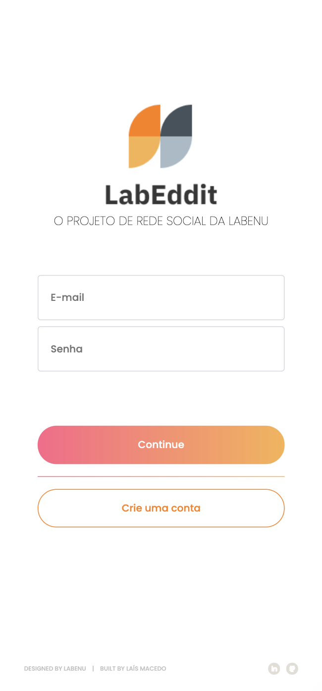
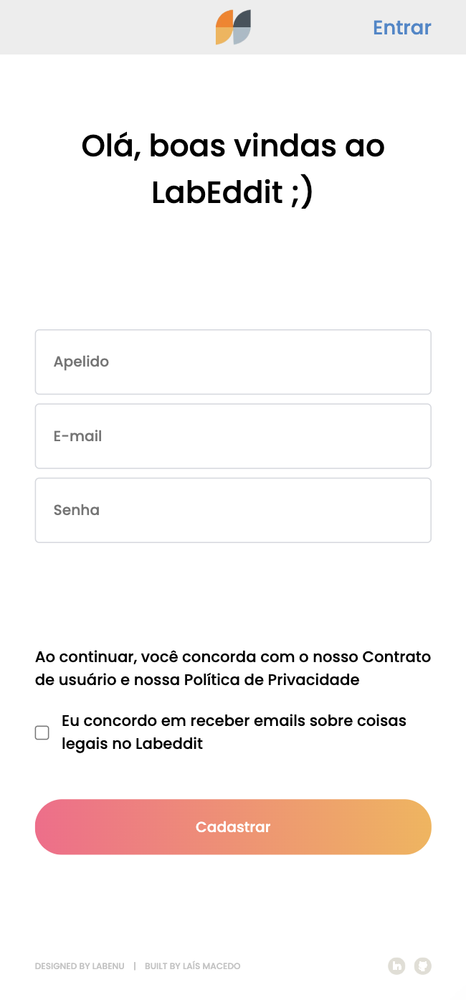
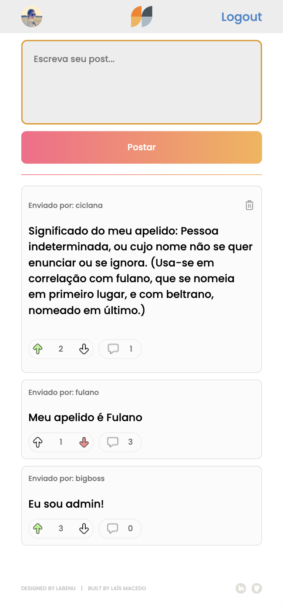
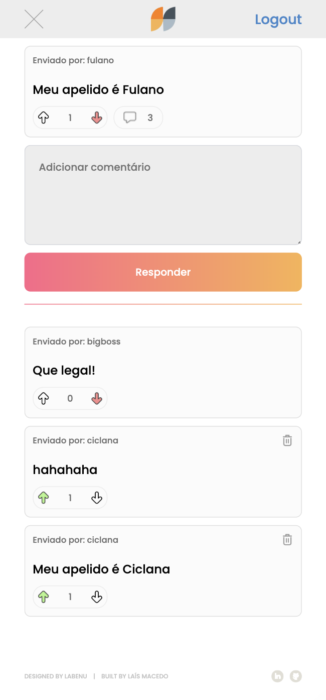

  

<h3 align="center">FRONTEND PROJECT</h3>
 

## 📝 Description

LabEddit is a full stack web project, developed with a mobile first app design that allows interaction between users through posts, comments and votes. Users can also change their nickname, password and avatar image, in addition to deleting their own posts and comments.

## 📱 Screens

  
  
  
  
  

## ☁️ Deploy

Frontend: [labeddit-laisrmacedo.surge.sh/users/login](https://labeddit-laisrmacedo.surge.sh/users/login)

Backend: [labeddit-backend-deploy.onrender.com/](https://labeddit-backend-deploy.onrender.com/)

## 🛠 Technologies

- React; 
- Styled-Components; 
- Data streams;
- Conditional rendering;
- LocalStorage;
- React Router; 
- Axios;
- API integration;
- Frontend deploying on Surge.sh;
- Backend deploying on Render.com.

## 👩‍💻 Author

Labenu's design team  

Laís Rodrigues Macedo  
laisrodriguesmacedo@gmail.com  
WhatsApp: (+49) 174 7781517

